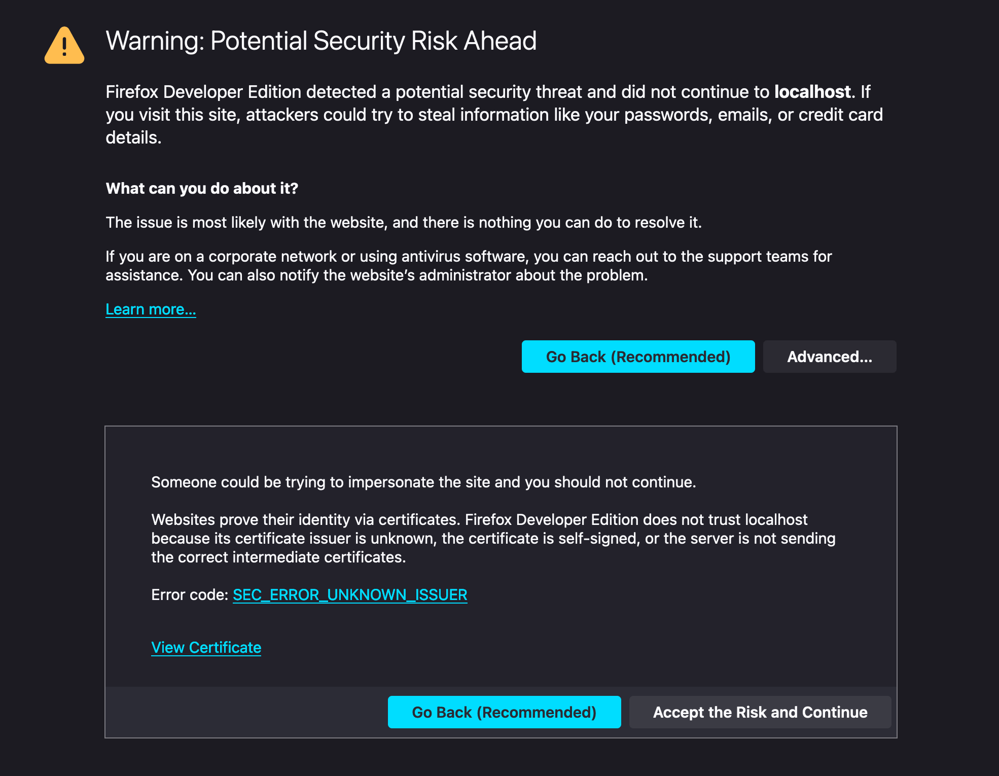
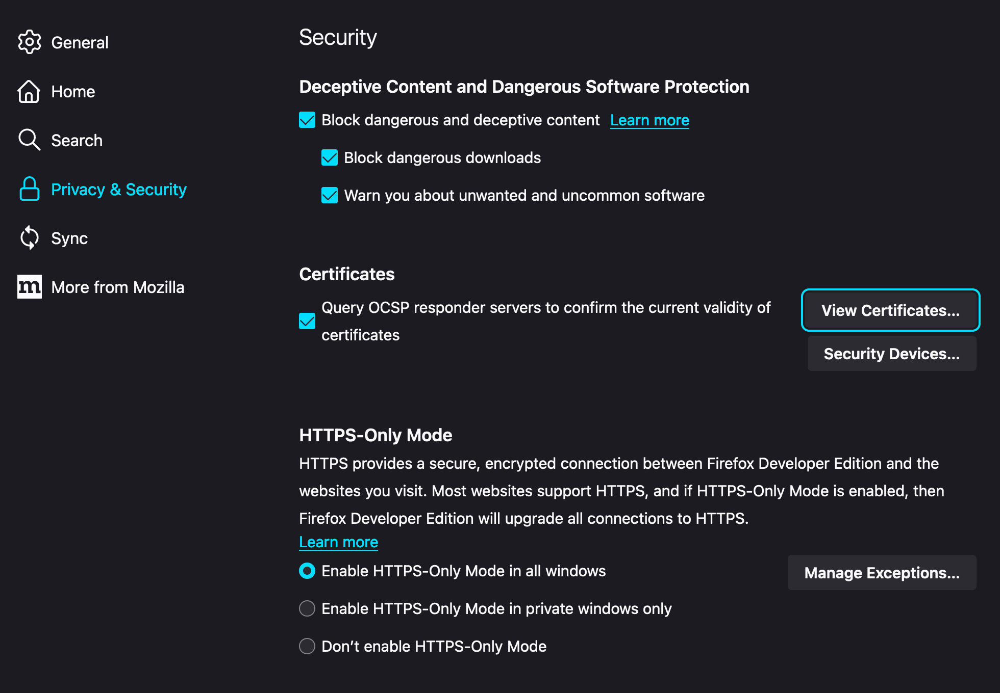
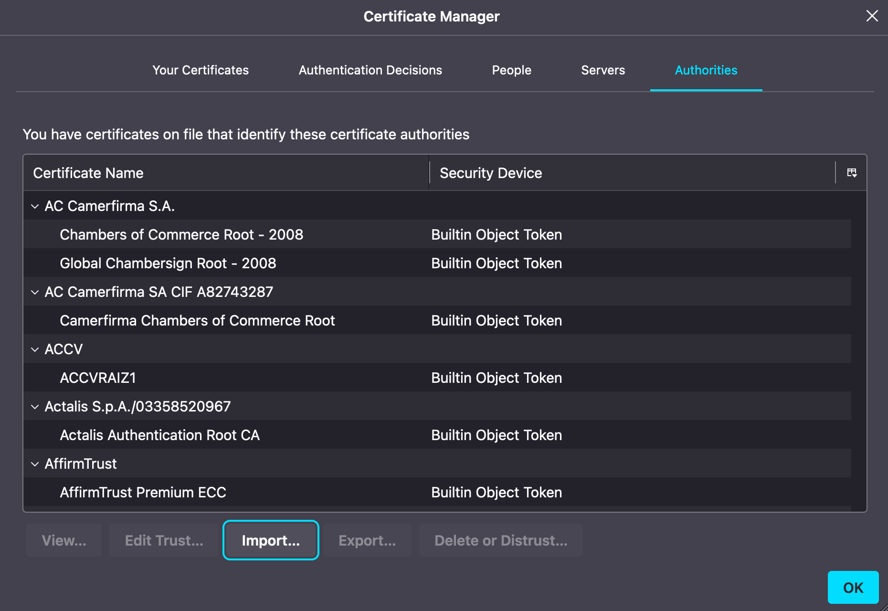
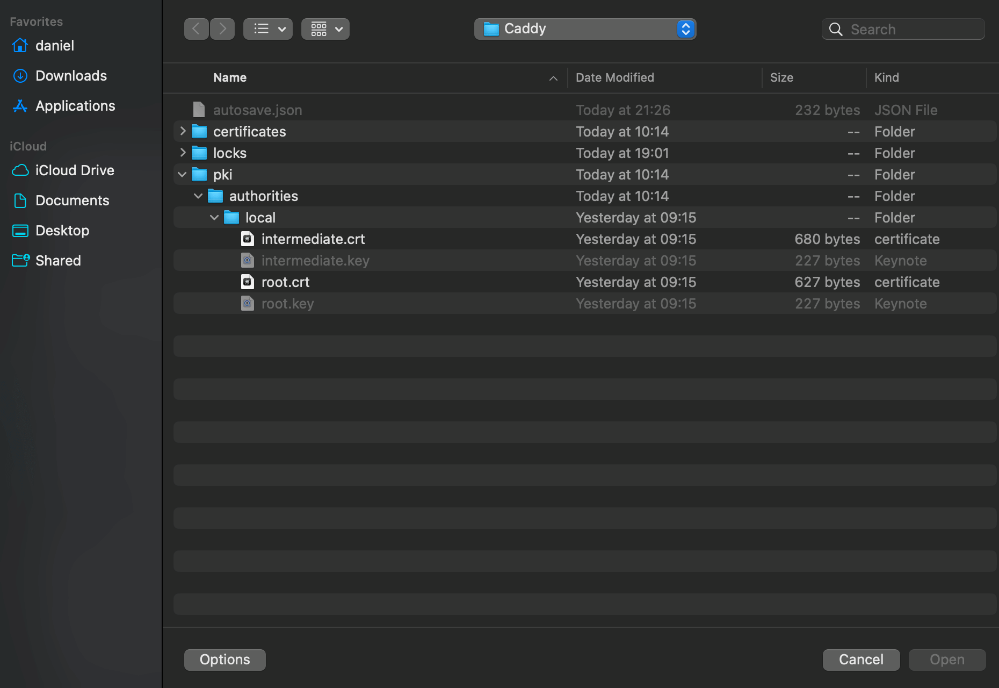
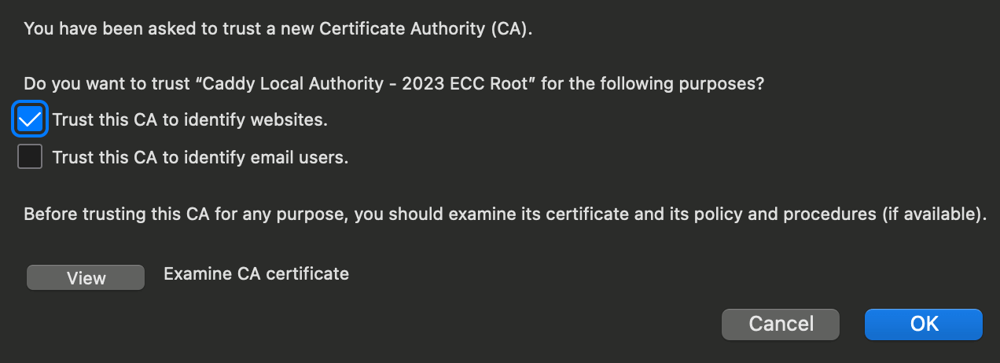
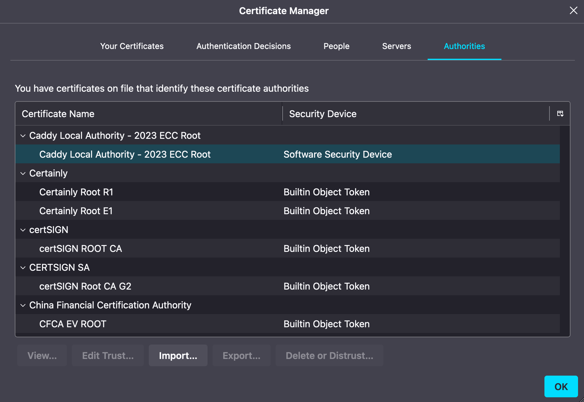

> [!note] Update
>
> On Windows, macOS, and Android, Firefox 120+ [automatically](https://support.mozilla.org/en-US/kb/automatically-trust-third-party-certificates) trusts third-party root certificates installed in the operating system's trust store, with this feature enabled by default.
> On Linux, this is not enabled by default, so you may still need to import Caddy's CA manually.

When running [Caddy](https://caddyserver.com/) locally, it will also generate its own local Certificate Authority (CA).
Caddy will use this CA to sign certificates for [local HTTPS](https://caddyserver.com/docs/automatic-https#local-https).

This is pretty cool!
When Firefox uses the operating system trust store, Caddy's local HTTPS works if its CA is trusted there.
If that trust is unavailable, Firefox will show the error code `SEC_ERROR_UNKNOWN_ISSUER` when visiting `https://localhost`.

If Firefox does not recognize the CA from the operating system trust store, you can [manually import](https://support.mozilla.org/en-US/questions/1175296) Caddy's local root certificate into Firefox.

## How to import Caddy's local root certificate into Firefox?

1. Open Firefox and go to `about:preferences#privacy`.

2. Scroll down to the `Security > Certificates` section and click `View Certificates`.

   

3. Select the `Authorities` tab and click `Import`.

   

4. Find Caddy's local root certificate in its [data directory](https://caddyserver.com/docs/conventions#data-directory) and open it. On a Mac it's located at `~/Library/Application\ Support/Caddy/pki/authorities/local/root.crt`.

   

5. Check the `Trust this CA to identify websites` checkbox and click `OK`.

   

6. The `Caddy Local Authority` should now be listed in the `Authorities` tab.

   

7. Restart Firefox, and accessing localhost over HTTPS will now work!
