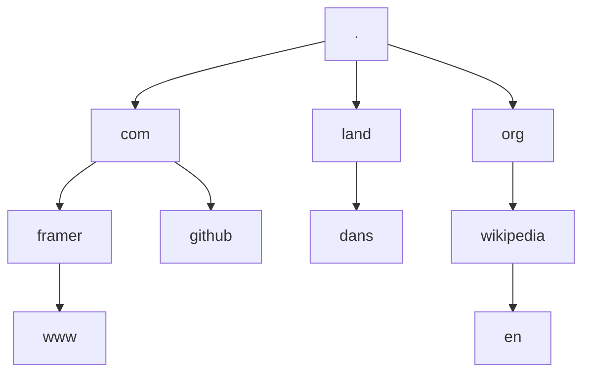

My understanding of DNS was always pretty basic.
But since I started working more with hosting infrastructure, I've learned a lot more about it.

I think DNS is really cool, but it _is_ complicated.
There are a lot of moving parts and terminology you need to know about to understand it.
So I decided to write a bit about this.
Mostly to capture and solidify my learnings, but maybe it can also be useful to others.

## Why do we need DNS?

The internet is a _massive_ system of interconnected computer networks,
and devices connected to this network communicate with each other by sending "packets of data".
But to make sure that these packets are routed to the correct destination, a **protocol** must be followed.

What's a protocol? It's basically a set of rules that need to be followed to achieve "something".

For example, to mail a letter, the protocol is that you must:

1. Use an envelope.
2. Write the sender and delivery address on the envelope (using a name, street address, city and zip code).
3. Use a postage stamp.
4. Deposit the envelope in a mailbox or at a post office.

But if one of these rules is broken (e.g. because phone numbers were used for rule 2 above) the letter will not be delivered.

It's a bit like that on the internet.
But the protocol that's used is called the **Internet Protocol** (IP),
and instead of using mail addresses to deliver mail to the correct destination,
**IP addresses** must be used to deliver packets of data to the correct destination[^1].

[^1]: The IP protocol is basically the addressing system of the internet, but there's more needed to deliver packets from source to destination. The exact details are out of scope for this page, but there's also a transport protocol needed to define rules _how_ data is sent and received. Ultimately there are multiple protocols needed which are "layered" on top of each other, like [TCP/IP](https://en.wikipedia.org/wiki/Internet_protocol_suite).

IP addresses identify network interfaces or destinations, but they are not universally unique device identifiers:
private addresses are reused, and anycast addresses can represent multiple interfaces.
For example, if a device wants to visit this website it must (at the time of this writing) go to IP address `188.114.96.0` or `188.114.97.0`[^2].

[^2]: This is an IPv4 address, and IP version 4 has been around since 1983. It works great, but we're running out of unique IPv4 addresses because nowadays even toasters must connect to the internet. This is where IPv6 comes in: IPv6 expands an address from 32 bits to 128 bits to make sure all toasters are covered! For example, `2a06:98c1:3120::` is an IPv6 address. But IPv6 is not completely adopted yet, so it's still common to use IPv4.

IP addresses work great for machines and robots because they _love_ numbers.
But us humans usually have difficulty remembering them and we prefer using a more memorable **domain name** instead.

But on the internet IP addresses must be used. So how can you for example type a domain name in a web browser and somehow still end up at the correct IP address?
Well, this is the main problem that DNS solves: **DNS can look up the IP address of a domain name**.

## What is DNS?

Practically speaking, DNS is like a phone book[^3] for the internet.

[^3]: In case you don't know, a phone book is literally a [book of phone numbers](https://en.wikipedia.org/wiki/Telephone_directory). A long time ago they were used to find a phone number for a person or business when you only knew their name.

Technically speaking, DNS is a distributed naming system that consists of many servers spread across the globe.

I like to think about DNS as a very large partitioned database that organizes, stores, and retrieves information about domain names.
To do all of this, DNS has the following main components:

- The domain name space (to organize domain names).
- Name servers and resource records (to store information about domain names).
- Resolvers (to retrieve information about domain names).

### The domain name space

The domain name space is a conceptual model that organizes all domain names on the internet,
and it can be visualized as a hierarchical structure that looks like a [tree](<https://en.wikipedia.org/wiki/Tree_(data_structure)>).

This hierarchy is reflected in domain names themselves:

- Each part of a domain name that is separated with a `.` (dot) is called a **label**.
- Each label represents a node in the tree, and is a "sublevel" in the naming hierarchy.
- The root of the tree is the "nameless" label `.` (dot), also called the **root domain**[^4].

[^4]: The root domain is typically not specified. For example, you'd usually type `github.com` in your browser instead of `github.com.` (note the trailing dot). But you can absolutely include it! Strictly speaking, a **Fully Qualified Domain Name** (FQDN) includes the root and is written with that trailing dot. In everyday use though, `github.com` is often still called an FQDN without it.

For example, the labels of the domain names:

- `www.framer.com`
- `github.com`
- `dans.land`
- `en.wikipedia.org`

Can be visualized in the domain name space like this:

#### Top-level domains and subdomains

By following the tree of the domain name space from top-to-bottom, the labels of a domain name go from most generic (`.`) to most specific (e.g. `www`).
And depending on what "level" these labels sit in the tree, they are referred to differently.

When reading a domain name from left-to-right:

- The right-most label is called the **top-level domain** (TLD). There are different kinds of TLDs[^5], but the most notable are:
  - Generic top-level domains (gTLDs), like `com` or `org`.
  - Country code top-level domains (ccTLDs), like `uk` or `nl`.
- The label before the TLD is called the **second-level domain** (2LD). The label before that is called the **third-level domain** (3LD). This can go on and on: fourth-level, fifth-level, etc. But often all labels before the 2LD are just called a **subdomain**.

[^5]: There are [6 types of TLDs](https://en.wikipedia.org/wiki/Top-level_domain): country code (ccTLD), generic (gTLD), generic restricted (grTLD), infrastructure (ARPA), sponsored (sTLD), and test (tTLD) top-level domains.

For example, for the domain name `www.bbc.co.uk`:

- `uk` is the TLD (ccTLD).
- `co` is the 2LD.
- `bbc` is the 3LD.
- `www` is the 4LD.

### Name servers and resource records

Each label in the domain name space will usually have some information associated with it (e.g. an IP address).
This information is represented by **resource records** (usually called DNS records).
A zone file is one text-file representation of those records, and DNS servers that serve resource records are called **name servers**.

There are different kinds of resource records, and I won't cover all of them on this page, but 3 important ones are:

- **NS records** store the name server of a domain name.
- **A records** store the IPv4 address of a domain name.
- **CNAME records** point to another domain name.

#### DNS zones

Each **DNS zone** is an administratively managed portion of the domain name space and has an **operator**:
an organization responsible for managing that portion.
Name servers serve the zone's records.

DNS zones usually don't map to domain names or DNS servers exactly, so they can be a bit ambiguous.
But they will usually map to level(s) of the domain name space tree (like the root zone, but more on that later).
This means that **zones only serve parts of the information in the domain name space**, where a zone can be served by multiple name servers.

I like to think about DNS zones as partitions of the entire database.
DNS needs to store a lot of information (and make it globally available), so it splits up its database into zones.
To make sure the system as a whole scales and runs reliably, each zone has an operator that's responsible for it.

### Resolvers

Name servers only store part of the domain name space, so how can DNS retrieve information for every name in the domain name space?
Most name servers just point to _other_ name servers,
and it's up to a **recursive resolver** (also called a recursor) to follow these "pointers" and retrieve resource records.
A browser or operating system usually has a **stub resolver**, which forwards its query to a recursive resolver instead of following the chain itself.

## How does DNS work?

So far we've covered the main components of DNS, but to understand how it works we first need to explicitly identify the different kinds of DNS servers and how they interact with each other.

There are 4 different kinds of servers needed to make DNS work:

- **Root name servers** are the name servers that serve the **DNS root zone**. This is a special DNS zone that contains _all_ TLDs of the domain name space. The DNS root zone consists of 13 root name servers[^6], and each root name server contains the [root zone database](https://www.iana.org/domains/root/db). This contains NS records that delegate TLDs to their name servers, and may include glue records with their IP addresses. Such lists are published as plain text files called **DNS zone files** (like the [root zone file](https://www.internic.net/domain/root.zone)).
- **TLD name servers** serve a TLD zone that contains delegations for 2LDs (for a specific TLD). These delegations return NS records naming the authoritative name servers, and may include glue records with their IP addresses.
- **Authoritative name servers** are authoritative for a zone: they serve the resource records for that administratively managed portion of the domain name space.
- **Recursive resolvers** receive requests from stub resolvers to find resource records (e.g. an IP address). They send **queries** to name servers and receive resource record(s) back as an **answer**. A recursive resolver that queries the DNS hierarchy itself uses a [hard-coded list](https://www.internic.net/domain/named.root) of the 13 root name servers as its starting point. It can also use cached data or forward the query to another recursive resolver. Clients often use the recursive resolver provided by their network or Internet Service Provider (ISP)[^7].

[^6]: There are 13 clusters of hundreds of physical DNS root servers, distributed all over the globe. You can see them (and their location) on [root-servers.org](https://root-servers.org/).

[^7]: But you can change this in the network settings of your operating system and use a different resolver, like Cloudflare's [1.1.1.1](https://developers.cloudflare.com/1.1.1.1/) or Google's [8.8.8.8](https://developers.google.com/speed/public-dns/docs/using).

> [!note] About authoritative name servers
>
> I used to be confused about what authoritative name servers are and how they differ from other name servers.
>
> But an authoritative name server is just a name server that serves authoritative data for a zone.
> So it depends on the queried name and its zone which name server is authoritative.
>
> For example, root name servers are authoritative for the root zone,
> TLD name servers are authoritative for a TLD zone,
> and when querying the A record for a domain name,
> the name server serving the zone that contains the record is authoritative.

With that covered, we can finally answer the question below.

### What happens when you visit a website in your browser?

The following simplified example assumes the recursive resolver has nothing useful cached and queries the DNS hierarchy itself:

1. The browser's stub resolver sends a request to a recursive resolver to find the A record of the entered domain name.
2. The resolver sends a query to one of the 13 root name servers to find the TLD name server of the domain name. When found, the root name server sends an NS record back (with the name of the TLD name server) as the answer to the resolver.
3. The resolver sends a query to the TLD name server to find the authoritative name server of the 2LD of the domain name. When found, the TLD name server sends an NS record back (with the name of the authoritative name server) as the answer to the resolver.
4. The resolver sends a query to the authoritative name server to find the A record of the domain name. When found, the authoritative name server sends an A record back (with the IP address of the domain name) as the answer to the resolver.
5. The resolver responds with the IP address of the domain name to the browser.
6. The browser can now make an HTTP request to the IP address and fetch the website.

> [!note] The steps above are for uncached queries
>
> Since there can be a lot of steps needed to look up information for a domain name, resolvers will cache the results of queries.
>
> For example, when a query is made for a domain name that was recently looked up,
> the resolver can skip (some of) the steps above and return the cached result(s) immediately.
>
> Caching can happen at every step above: on the name server(s), resolver, on the browser and operating system.

## Bonus: how is the domain name system managed?

We now know that DNS is basically a very large database that's split up into zones, and that zones are managed by operators.
But how do operators work together? How do operators know about changes that occur in the domain name space (like when a new domain name is registered)?
And who oversees all of this?

### ICANN and IANA

[ICANN](https://www.icann.org/) (Internet Corporation for Assigned Names and Numbers) and [IANA](https://www.iana.org/) (Internet Assigned Numbers Authority) are 2 organizations that help provide stability and consistency on the internet.

ICANN helps with administration, oversight and maintenance. But delegates some of this to IANA (which is part of ICANN).

For example, ICANN coordinates DNS policy and adding [new TLDs](https://newgtlds.icann.org/en/about/program), and operates 1 of the 13 DNS root name servers.
IANA maintains shared lists of the numbers and names used by internet protocols (such as port numbers and DNS record types), coordinates global IP-address allocations through the regional Internet registries, and manages the DNS root zone.

### Domain name registries and registrars

Besides the root zone database managed by IANA, there are also organizations that manage a database of all 2LDs with a specific TLD.
These organizations are called **registry operators**[^8].
Strictly speaking, the databases they maintain are called **registries**, but often the operator itself will also be referred to as the registry.

[^8]: Registry operators (or registries) are sometimes also called a Network Information Center (NIC).

This means each TLD has a registry.
For example, [Verisign](https://www.verisign.com) is the registry for `.com` domain names and [Google Registry](https://www.registry.google) is the registry for `.dev` domain names.
Verisign and Google actually manage multiple TLDs, but there are also registries that manage a single TLD.

So how do these registries know about (new) domain names?
Some registries allow you to directly register a domain name with them.
But most registries will partner with a different organization called a **domain name registrar**.

Domain name registrars are companies that allow you to register domain names by paying them a fee.
When you register a domain name, you don't actually buy the domain name.
But you will hold the "right" to use it for a specific amount of time.
You then become the **registrant** of the domain name and will be considered the "owner" of it.

Registries allow registrars to partner with them by entering a **Registry-Registrar Agreement**.
But in order to do so, the registrar must meet the requirements[^9] set by the registry (and ICANN).
After the agreement is in place, the registrar may offer their customers to register domain names for the specific TLD(s).
Every time a domain name is registered, renewed, transferred, or expires,
the registrar will then notify[^10] the registry,
where for some operations registrars also pay registries (and ICANN) a fee[^11].

[^9]: These requirements can differ per registry (and some make them [available online](https://www.verisign.com/en_US/channel-resources/become-a-registrar/verisign-domain-registrar/index.xhtml)). For example, most registries require the registrar to be [accredited by ICANN](https://www.icann.org/en/accredited-registrars). Sometimes registries even set rules that affect which _registrants_ may register a domain name for their TLD (e.g. [only US governments](https://get.gov/registration/requirements/) may register a `.gov` domain name).

[^10]: Registrars usually use the [Extensible Provisioning Protocol](https://en.wikipedia.org/wiki/Extensible_Provisioning_Protocol) (EPP) to interact with registries.

[^11]: The registrar must pay fees every time a domain name is registered, renewed or transferred. There's the registry fee (as defined in the Registry-Registrar Agreement). There may be an ICANN transaction fee (whose amount can change by fiscal year). But there might also be other fees, like an annual accreditation fee when the registrar is ICANN accredited.

## Resources

- [RFC 1034: Domain names concepts and facilities](https://datatracker.ietf.org/doc/rfc1034/)
- [RFC 9499: DNS Terminology](https://datatracker.ietf.org/doc/rfc9499/)
- [What is DNS?](https://www.cloudflare.com/learning/dns/what-is-dns/)
- [What does ICANN do?](https://www.icann.org/resources/pages/what-2012-02-25-en/)
