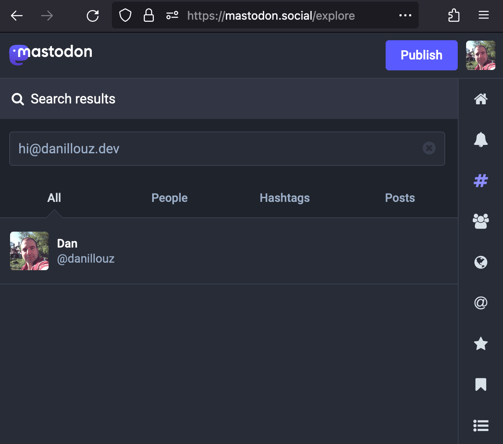

> [!note]
>
> I deleted my Mastodon account by now,
> so the endpoints and account URLs mentioned in this post are no longer live.

I'm not very active on social media, but I recently created a [Mastodon](https://joinmastodon.org/) account.

I'm still learning about the fediverse.
So I was reading the docs a bit, and that's when I stumbled upon [WebFinger](https://docs.joinmastodon.org/spec/webfinger/).

I never heard of it before, but Mastodon uses WebFinger to figure out the location of an account.
So it can for example resolve the account `danillouz@mastodon.social` to the location `https://mastodon.social/@danillouz`.

This location information is returned by a WebFinger endpoint.
Which made me wonder.
Could my site, hosted on a custom domain, return this information as well, so that I could use my custom domain as an "alias" for my Mastodon handle?
Turns out you can!
But there are some caveats.

## What's WebFinger?

WebFinger is a protocol[^1] that allows information about people or entities to be discovered over HTTP.
It basically resolves some sort of URI identifier (like an email address, Mastodon account, or phone number) to a location (i.e. a URL),
which can be retrieved by making a WebFinger request.

[^1]: [RFC 7033](https://www.rfc-editor.org/rfc/rfc7033) describes the WebFinger protocol.

### Making a WebFinger request

A WebFinger request is an HTTP `GET` request to a resource.
The resource is a well-known URI with a query target.
The query target identifies the entity to get the location for, which is specified via the `?resource=` query parameter in the request.
The endpoint then returns the location information as JSON.

For example, to get WebFinger information for the Mastodon account `danillouz@mastodon.social`[^2], you need to make the following request:

[^2]: Mastodon uses the `acct:` URI scheme as described in [RFC 7565](https://www.rfc-editor.org/rfc/rfc7565).

```sh title="HTTP request"
GET /.well-known/webfinger?resource=acct:danillouz@mastodon.social
HOST: mastodon.social
```

```sh title="HTTP response"
200 OK
Content-Type: application/json

{
  "subject": "acct:danillouz@mastodon.social",
  "aliases": [
    "https://mastodon.social/@danillouz",
    "https://mastodon.social/users/danillouz"
  ],
  "links": [
    {
      "rel": "http://webfinger.net/rel/profile-page",
      "type": "text/html",
      "href": "https://mastodon.social/@danillouz"
    },
    {
      "rel": "self",
      "type": "application/activity+json",
      "href": "https://mastodon.social/users/danillouz"
    },
    {
      "rel": "http://ostatus.org/schema/1.0/subscribe",
      "template": "https://mastodon.social/authorize_interaction?uri={uri}"
    }
  ]
}
```

You can replace the Mastodon domain and username with your own, to get your information instead:

```sh
https://{MASTODON_DOMAIN}/.well-known/webfinger?resource=acct:{MASTODON_USERNAME}@{MASTODON_DOMAIN}
```

### Why is WebFinger used?

On Mastodon, users have accounts on different servers.
Like [mastodon.social](https://mastodon.social) or [mas.to](https://mas.to).
So even though the handles `danillouz@mastodon.social` and `danillouz@mas.to` share the same "local" username `danillouz`, they are different accounts.

From what I understand, Mastodon's internal implementation can't just use the account handle.
It requires the location (provided by WebFinger) to convert an account to a user on its server for things like mentions and search to work.

## Adding a WebFinger endpoint

The RFC mentions that WebFinger information is static:

> [!quote]
>
> The information is intended to be static in nature,
> and, as such, WebFinger is not intended to be used to return dynamic information like the temperature of a CPU or the current toner level in a laser printer.
>
> [https://www.rfc-editor.org/rfc/rfc7033#section-1](https://www.rfc-editor.org/rfc/rfc7033#section-1)

So if you can host some static JSON on your custom domain, you can add a WebFinger endpoint.

You can do this by:

1. [[#Making a WebFinger request]] for your Mastodon account to get your WebFinger information.
2. Copy-and-pasting the WebFinger JSON response from step 1 to a static file.
3. Returning the JSON[^3] from step 2 whenever an HTTP `GET` request is made to `/.well-known/webfinger?resource=acct:{MASTODON_USERNAME}@{MASTODON_DOMAIN}` on your custom domain.

[^3]: The WebFinger RFC [mentions](https://www.rfc-editor.org/rfc/rfc7033#section-10.2) that the `Content-Type` of a WebFinger response should be `application/jrd+json`. But it looks like using `application/json` also works.

With that in place, your custom domain can be used to find your Mastodon account.

### Static file endpoint

I'm using [Astro](https://astro.build/), so I just added a [static file endpoint](https://docs.astro.build/en/core-concepts/endpoints/#static-file-endpoints):

```ts title="src/pages/.well-known/webfinger.json.ts" showLineNumbers
import type { APIRoute } from "astro"

const MASTODON_USERNAME = "danillouz"
const MASTODON_DOMAIN = "mastodon.social"

export const GET: APIRoute = async function ({ params, request }) {
  return new Response(
    JSON.stringify({
      subject: `acct:${MASTODON_USERNAME}@${MASTODON_DOMAIN}`,
      aliases: [
        `https://${MASTODON_DOMAIN}/@${MASTODON_USERNAME}`,
        `https://${MASTODON_DOMAIN}/users/${MASTODON_USERNAME}`,
      ],
      links: [
        {
          rel: "http://webfinger.net/rel/profile-page",
          type: "text/html",
          href: `https://${MASTODON_DOMAIN}/@${MASTODON_USERNAME}`,
        },
        {
          rel: "self",
          type: "application/activity+json",
          href: `https://${MASTODON_DOMAIN}/users/${MASTODON_USERNAME}`,
        },
        {
          rel: "http://ostatus.org/schema/1.0/subscribe",
          template: `https://${MASTODON_DOMAIN}/authorize_interaction?uri={uri}`,
        },
      ],
    }),
    { headers: { "Content-Type": "application/jrd+json" } },
  )
}
```

### Redirecting WebFinger requests

Note that the [[#Static file endpoint]] I added will only serve the WebFinger information when making the request:

```sh title="HTTP request"
GET /.well-known/webfinger.json
Host: www.danillouz.dev
```

But Mastodon will actually make the following request:

```sh title="HTTP request"
GET /.well-known/webfinger?resource=acct:danillouz@danillouz.dev
Host: www.danillouz.dev
```

Since I have just one Mastodon account,
I chose to just ignore the `?resource=` query parameter,
and redirect all requests from `/.well-known/webfinger` to `/.well-known/webfinger.json`.

I'm using [Vercel](https://vercel.com/), which supports [redirects](https://vercel.com/docs/project-configuration#project-configuration/redirects).
So I can achieve the desired redirect by adding the following rule:

```json title="vercel.json" showLineNumbers
{
  "redirects": [
    {
      "source": "/.well-known/webfinger",
      "destination": "/.well-known/webfinger.json"
    }
  ]
}
```

## Using my custom domain as an alias

Now that my custom domain has a WebFinger endpoint, I can find my Mastodon account by using my custom domain!

For example, searching for `hi@danillouz.dev` will now give me a hit.



## So how useful is this?

I'm not sure to be honest.

Like mentioned before, Mastodon is a bit different, where an account handle consists of two parts:

- The local username. For example `danillouz`.
- The server domain. For example `mastodon.social`.

The docs mention that you should include the server domain when sharing your handle with other people, because otherwise they won't be able to find you easily:

> [!quote]
>
> Mastodon allows you to skip the second part when addressing people on the same server as you,
> but you have to keep in mind when sharing your username with other people,
> you need to include the domain or they won't be able to find you as easily.
>
> [https://docs.joinmastodon.org/user/signup/#your-username-and-your-domain](https://docs.joinmastodon.org/user/signup/#your-username-and-your-domain)

So in theory, setting up an alias allows you to create a handle that does not change when migrating to a different Mastodon server.
It might make your account easier to find if people know your custom domain.

It's also pretty cool that with the alias you can have a Mastodon handle that includes your custom domain without needing to host your own Mastodon server.
But practically speaking, searching for just the local username on different servers also works as far as I can tell.

When the docs mentioned that you should include the server domain when sharing your handle,
I thought this meant that someone would always have to search for `danillouz@mastodon.social` on servers _other_ than `mastodon.social` to find me.
But this doesn't appear to be the case.
For example, I can search for `danillouz` on `mast.to` and it will find me.

So maybe, aliasing your handle isn't really a good idea?

I'm not sure if having an "extra" WebFinger endpoint can actually break stuff (can information become stale?).
But there are some caveats when using your custom domain as an alias to be aware of.

## Caveats

There might be more, but these are the ones I encountered.

### Users need to be signed in to find you via the alias

I created my account on `mastodon.social`, and there I can find my account when searching for the alias without problems.
But when I tried finding my account using the alias on a _different_ server, I was surprised there was no result.

Turns out that when you're not signed in to a server, the search API will not use WebFinger to resolve the handle!

This is how the search request looks like when I'm signed in:

```sh title="HTTP request" /resolve=true/
GET /api/v2/search?q=hi@danillouz.dev&resolve=true
Host: mastodon.social
```

And this is how the same search request looks like when I'm signed out:

```sh title="HTTP request" /resolve=false/
GET /api/v2/search?q=hi@danillouz.dev&resolve=false
Host: mastodon.social
```

The difference is that the query parameter `resolve` is set to `true` when signed in.
But it is set to `false` when signed out.

Checking the v2 search API docs, we can see that `resolve` controls if a WebFinger lookup should happen or not:

> [!quote]
>
> Boolean. Attempt WebFinger lookup? Defaults to false.
>
> [https://docs.joinmastodon.org/methods/search/#query-parameters](https://docs.joinmastodon.org/methods/search/#query-parameters)

### The alias behaves like a "catch-all"

Since I'm [[#Redirecting WebFinger requests]], I'm returning the same response for all `acct:` queries.
In my original testing, any[^4] local username could be provided together with my custom domain.

[^4]: Sadly, using emoji didn't work though.

Mastodon [validates](https://docs.joinmastodon.org/spec/webfinger/#mastodons-requirements-for-webfinger) an alias by resolving it to an ActivityPub actor and checking the actor's canonical WebFinger address.
Both addresses must resolve to the same actor.
So a catch-all can make many usernames resolve to one account, but it does not create separate accounts for them.

For example, these all worked:

- `hey@danillouz.dev`
- `737@danillouz.dev`
- `lol@danillouz.dev`

## Resources

- [Mastodon on your own domain without hosting a server](https://blog.maartenballiauw.be/post/2022/11/05/mastodon-own-donain-without-hosting-server.html)
- [Integrating Mastodon with Astro](https://www.lindsaykwardell.com/blog/integrate-mastodon-with-astro)
